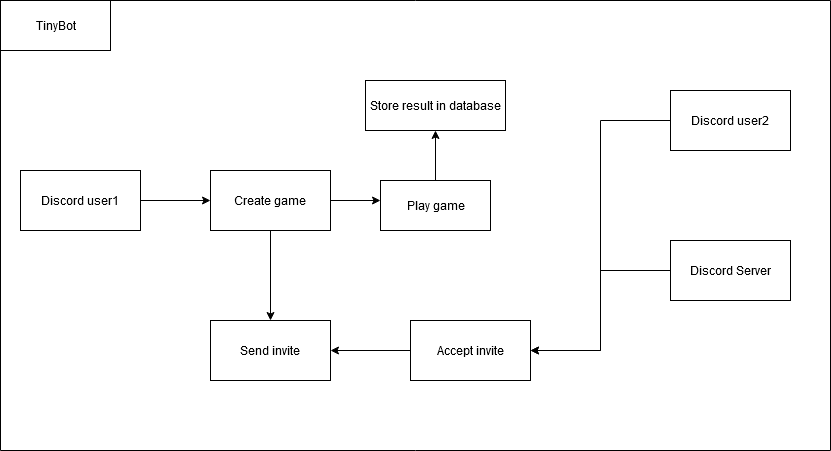

# TinyBot

## Project Abstract
The project that I am proposing is a stand-alone project. TinyBot is a discord bot that will be used by the users to play minigames with eachother. The users will be able 
to invite the bot into their server and play against each other by inviting each other to the game. The bot will also have a database that will be used to implement the leaderboard to allow the user to be able to view their game statistics, how many games they have won so far, and who has most wins in the server. The games that will be implemented are tic-tac-toe, mini-chess, battleship, coin flip, connect 4 and more in the future.

## Project Relevance
TinyBot meets a lot of key educational goals. This project would cover topics such as test driven development, UML, debugging, access to database, design patterns, and code profiling and optimization. We will also meet the practical experience in using modern software development tools using project management, test, and issue tracking on Github.

## Conceptual Design
It is still a work in progress in my mind but so far I have planned to create the whole discord bot obviously. There will be a couple of features that will be implemented such as multiple games as mentioned in abstraction, the user picking a game and creating an invite to start the game, each user will take turns to make their move, once the game is over the result will be recorded in the leaderboard database to view later by the users. The users will also be able to view the server leaderboard specific to each server that will keep track of who has won the most games within that server and so on. 

## Background

***Building***
- Will be written in python
- Need a Discord Developers account
- Need to create a bot on discord first then code it.
- Need to create a discord server to test the bot

**Running**
- You can run and test it by creating a server and adding the bot on the server
- You can simply run the main script on your computer to run the bot

## Required Resources
Discord, Python3, Discord.py API
